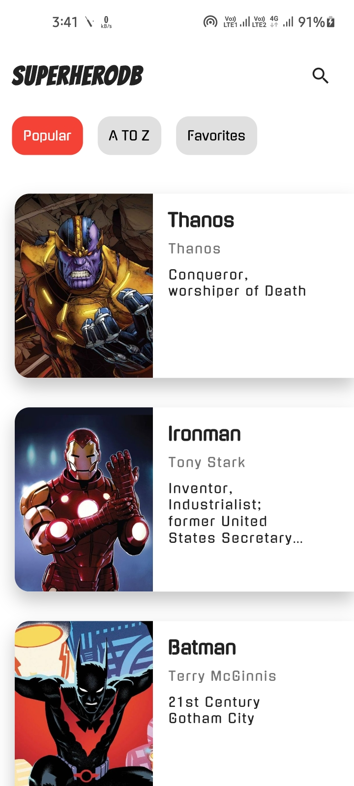
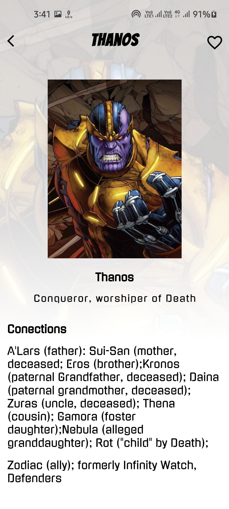
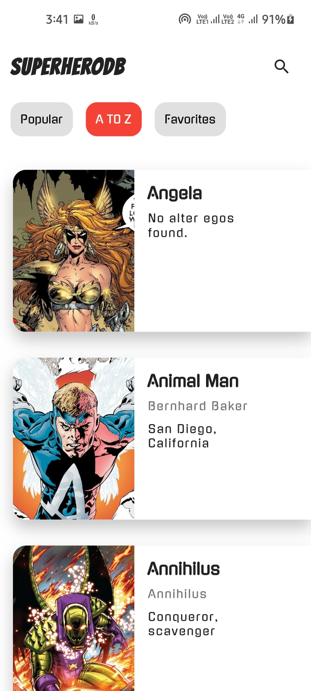
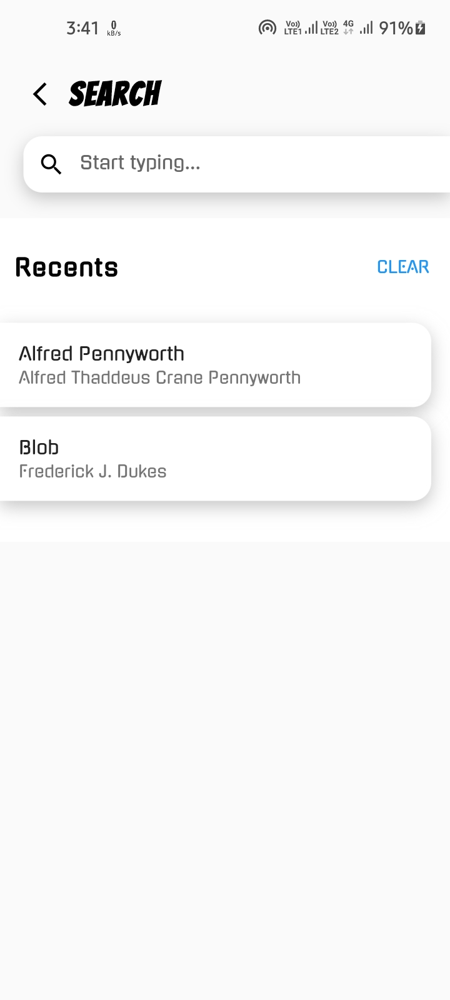
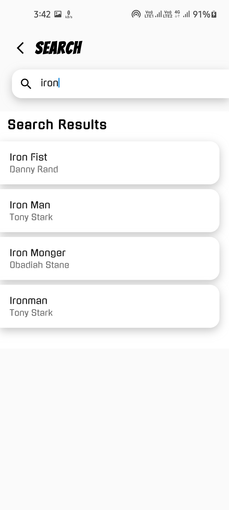

# SuperHERO

## App Features.
Simple Superheros information app with animations and local database. 

## App Information

**Packages used:**

- cached_network_image: ^3.1.0
- google_fonts: ^2.1.0
- hive_flutter: ^1.1.0
- path_provider: ^2.0.2


<p align="center">








</p>

## How to use

To clone and run this application, you'll need [Git](https://git-scm.com/downloads) and [Flutter](https://flutter.dev/docs/get-started/install) installed on your computer. From your command line:

```
# Clone this repository
$ git clone https://github.com/Ansh-Rathod/Flutter-SuperHERO-App.git

# Go into the repository
$ cd Flutter-SuperHERO-App

# Install dependencies
$ flutter packages get

# Run the app
$ flutter run
```
